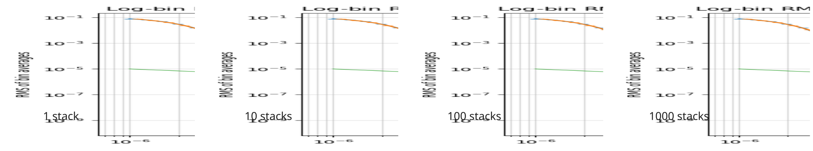

A TEM instrument basically collects a raw time series of digital data, e.g., voltages proportional to $\frac{ \partial  }{ \partial t }B_{z}(t)$ as output from an ADU (Analog-to-Digital converter Unit).

This time series is a discrete sequence of equidistant samples with the constant sampling interval
$$
\Delta t = t_{k+1} - t_{k}
$$
between time instances $t_{k}$ and $t_{k+1}$.

The dynamics of the TEM induction process requires a different scaling of the observation time.
Usually, data at log-equidistant times is required. 

For log-equidistant times, we have
$$
t_{k+1} = r t_{k}, \ r > 1
$$
so,
$$
\Delta t_{k} = t_{k}(r - 1) \sim t_{k}.
$$

EM data are never noise-free.
Often, we assume that the noise $x_{i}$ in the data is _Gaussian noise_ with
$$
x_{i} \sim \mathcal N(0, \sigma^{2})
$$

To suppress the noise, the TEM data are collected repeatedly with a pre-defined repetition rate and are stacked (accumulated) until the maximum number of stacks is obtained.

However, the noise level may become significantly larger than the TEM response at late times. In such cases, the expected TEM asymptotic behavior may no longer be observable, rendering the late-time data unusable.

Because the raw data are sampled at an unnecessarily fine temporal resolution, TEM instruments typically average the measurements over time windows whose widths increase logarithmically.
The central time of such a _gate_ may be defined as the geometric mean
$$
\bar{t}_{k} = \sqrt{t_{k} t_{k+1}}.
$$

The average of data $x$ over a time window $[t_{k}, t_{k+1}]$ is
$$
\bar x_{k} = \frac{1}{t_{k+1} - t_{k}} \int\limits_{t_{k}}^{t_{k+1}} x(t) \, \mathrm d t 
$$

We substitute $t' := \log t$ and rewrite
$$
\bar x_{k} = \frac{1}{t_{k+1} - t_{k}} \int\limits_{\log t_{k}}^{\log t_{k+1}} x(e^{ t' }) e^{ t' }\, \mathrm d t' 
$$

We introduce a log time-shift (i.e., a ratio of subsequent linear times) into the time window as $u = t' - \log t_{k}$.

So, $\,\mathrm{d} t' = \,\mathrm{d} u$, and
$$
\begin{align}
\bar x_{k} & = \frac{1}{t_{k+1} - t_{k}} \int\limits_{0}^{\log r} x(e^{ u + \log t_{k} }) e^{ u + \log t_{k} } \,\mathrm{d} u \\
& = \frac{1}{t_{k+1} - t_{k}} \int\limits_{0}^{\log r} x(t_{k}e^{ u }) t_{k} e^{ u } \,\mathrm{d} u \\
& =  \frac{t_{k}}{t_{k+1} - t_{k}} \int\limits_{0}^{\log r} x(t_{k}e^{ u }) e^{ u } \,\mathrm{d} u \\
& =  \frac{1}{r - 1} \int\limits_{0}^{\log r} x(t_{k}e^{ u }) e^{ u } \,\mathrm{d} u 
\end{align}
$$

The variance of $\bar x_{k}$ is
$$
Var(\bar x_{k}) = \frac{1}{(r - 1)^{2}}  \int\limits_{0}^{\log r} \int\limits_{0}^{\log r} \mathbb E[x(t_{k}e^{ u }) x(t_{k}e^{ v })] e^{ u } e^{ v }\, \mathrm d u \,\mathrm{d} v   
$$

Considering that $x(t)$ is continuous, uncorrelated white noise, there holds
$$
\mathbb E[x(t) x(s)] = \sigma^{2} \delta(t - s)
$$

We need $\delta (t_{k }e^{ u } - t_{k}e^{ v })$, that is, the composition of the delta function and the continuous function $f(v)$.

Further, we need the transformation rules of the delta function,
$$
\delta (f(v)) = \frac{\delta(v - v_{0})}{|f'(v_{0})|},
$$
where
$$
f(v) = t_{k }e^{ u } - t_{k}e^{ v }.
$$
The root (zero) of $f(v)$ is $v_{0} = u$.
The derivative of $f(v)$ is
$$
f'(v) = -t_{k} e^{ v }
$$
which we evaluate at the root of $f(v)$
$$
f'(v_{0}) = -t_{k} e^{ u }
$$
Finally, 
$$
\delta (t_{k }e^{ u } - t_{k}e^{ v }) = \frac{\delta (v - u)}{t_{k} e^{ u }}.
$$

So,
$$
\mathbb E[x(t_{k}e^{ u }) x(t_{k}e^{ v })] = \sigma^{2} \frac{\delta (v - u)}{t_{k} e^{ u }}.
$$

Inserting this gives
$$
Var(\bar x_{k}) = \frac{\sigma^{2}}{(r - 1)^{2}}  \int\limits_{0}^{\log r} \int\limits_{0}^{\log r} \frac{\delta(v - u)}{t_{k}e^{ u }} e^{ u } e^{ v } \,\mathrm{d} u \,\mathrm{d} v  ,
$$

integration over $v$ yields
$$
Var(\bar x_{k}) = \frac{\sigma^{2}}{(r - 1)^{2}}  \int\limits_{0}^{\log r} 
\frac{e^{ u }}{t_{k}} \,\mathrm{d} u =  \frac{\sigma^{2}}{(r - 1)^{2} t_{k}} e^{ u }\bigg|_{0}^{\log r}.
$$
Since $e^{ \log r } - 1 = r - 1$, this yields
$$
Var(\bar x_{k}) = \frac{\sigma^{2}}{(r - 1)^{2} t_{k}} (r - 1) = \frac{\sigma^{2}}{(r - 1) t_{k}}.
$$
Thus,
$$
Std(\bar x_{k}) \sim t_{k}^{-1/2}.
$$

## Interpretation

A log-spaced bin has width $\Delta t_{k} \sim t_{k}$.
Averaging white noise over a wider interval reduces its standard deviation like $1 / \sqrt{\text{window length}}$.
Since the window length grows linearly with $t_{k}$, the standard deviation decays like $1 / \sqrt{t_{k}}$. 

## Numerical experiment

In the following, we examine how Gaussian noise propagates into the data when the measurements are integrated over a time window $\Delta t_{k}$.

We consider the exact TEM response of the uniform halfspace for a HCP loop-loop configuration:

- TX-RX offset: $20$ m
- TX dipole moment: $10^{4}$ Am$^{2}$ 
- Halfspace resistivity: $20\ \Omega\cdot$m
- Time interval: $10^{-6} \le t \le 10^{-2}$ s

This response will be ''measured'' at a very high constant sampling rate.
Further, we contaminate the exact response with Gaussian noise $\mathcal N(0, \sigma^{2})$ with $\sigma=10^{-4}$ thus resulting in a realistic dataset.

The contaminated data are averaged over $41$ logarithmically increasing time windows.
We observe a distinct change in the asymptotic behaviour of the transient.
While uncontaminated (exact) data is proprtional to $t^{-5/2}$, the noise dominates at late times with an asymptotic of $t^{-1/2}$.

The noise can be further suppressed by _stacking_, i.e., averaging the bin-averaged data over many statistically independent realizations.

The effect of stacking is illustrated in the following figure.

